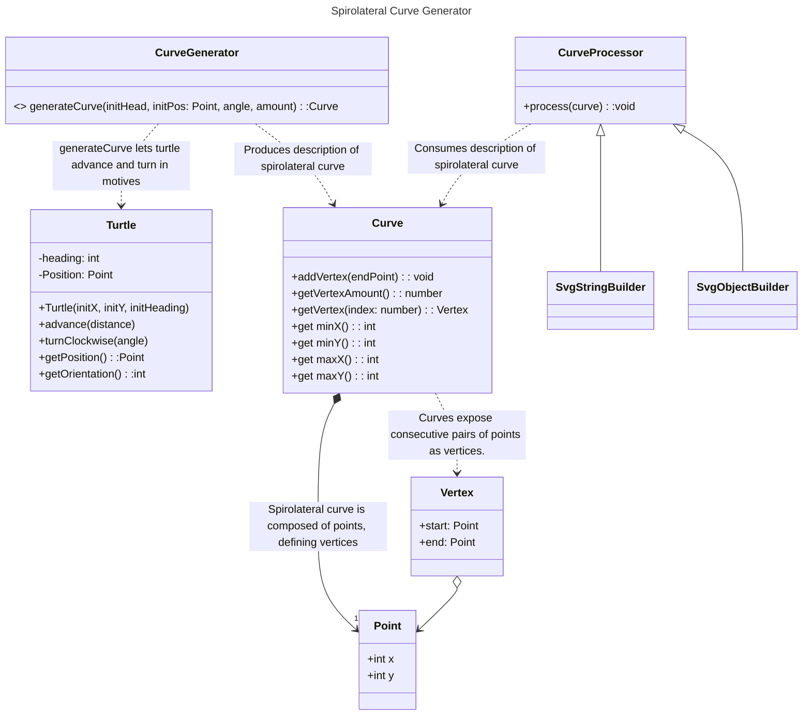

# Spirolateral Curve Viewer

An exploratory project, to learn and document typescript practices and tools, on the example of a spirolateral curve viewer webapp.

## Project goals

Although a visual project, the purpose is a familiarization with typescript and its environment. As such, the priorities are:

-   Document the project and tools as starting point for future personal project: [typescript.md](typescript.md)
-   Stick to typescript, avoid javascript where possible.
-   Apply coding best practices and conventions, notably:
    -   Reference configuration of npm.
    -   A reasonably strict linter configuration (enforce format and comments).
    -   Unit tests.
-   Avoid libraries / third party dependencies doing too much heavy lifting (including build dependencies - but with exception to what is needed for a best-practice build)
-   Stick to popular tools, document tool selection and configuration: [environment.md](environment.md)
    -   VSCode
    -   IDE plugins
    -   Node / npm plugins

> The remainder of this page documents the spriolateral curve context and the elicited software design.

## Spirolateral Curves

This program generates _spirolateral curves_, which can be generated using a _turtle geometry model_.

### Turtle geometry model

Imagine a turtle moving slowly forward, with a pen attached to its belly. Let's further consider that the turtle can only perform two actions: [^1]

-   Move straight forward, for a given distance.
-   Turn in place, for a given angle.

If our turtle keeps repeating the above two actions, we can trace the path it took on paper.

Even without a _real_ turtle, we can attempt to generate the trace it's path, using a simple simulation.

### Motives

Spirolateral curves are a special case of turtle graphics, i.e. they can be realized using a turtle graphic simulation.

In contrast to general turtle graphics, the turtle's actions are not arbitrary, but follow a specific algorithm.

-   The turtle produces series of "_motives_".
-   Each motive is itself a series of moves and turns, where:
    -   The initial move has length `1`.
    -   The length of every follow-up move within a motive is the next a natural multiple, i.e. `2`, `3`, `4`, ...
    -   The angle between two moves is constant, e.g. "10 degrees left".

## Software design

This section details how concepts needed to generate and visualize spirolateral curves are translated to software components and behaviour.

### Turtle terminology

Throughout the implementation, we'll use the following terminology:

-   `heading`: direction of the turtle's head, as clockwise offset from north in degrees.

-   `counter`: the turtle's current count of steps within the current motive.

-   `amount`: the amount of steps within a motive.

-   `angle`: degrees by which the turtle will turn right after any move (including after completed motives).

### Components and behaviour

> Project components and relations. A `(Spirolateral) Curve` object is first produced, then consumed for visual presentation.

The main control flow consists of two phases:

1. **Generate** a spirolateral curve: A `CurveGenerator` uses a `Turtle` instance to incrementally produce `Curve` object (composed of a series of `Vertex` objects).
    - The `Turtle` object embodies only heading and position. The displacement strategy (how far to advance, angle to turn) is encoded in the `CurveGenerator`, which simply invokes the `Turtle`s corresponding `advance` and `turn` methods (see previous section, ["_Graphics_"](#spirolateral-curves)).
    - Every `Turtle` displacement holds a starting position (where the `Turtle` was before moving) and an iteration ending position (where the `Turtle` is located after moving). The position pair defines a `Vertex`, which will be eventually visualized.
2. **Process** a spirolateral curve: A `CurveProcessor` afterwards consumes the `Curve` object, to directly or indirectly visualize the total path taken by the `Turtle`.
    - The `SvgStringBuilder` produces a static file, which is stored on disk an can be inspected with an svg renderer, e.g. a browser.
    - The `SvgObjectBuilder` does not operate on String level, but constructs or modifies an SVG object, for dynamic visualization, i.e. instant re-rendering on `Turtle` parameter changes.

## Challenges and solutions

### Halting the turtle

A non-trivial problem is when to stop the turtle. Turtle graphics, based on the initial definition are repetitive, but not necessarily contained in space.

Testing for when a turtle is back to its starting position and heading is insufficient for two reasons:

-   Rounding errors prevent accurate testing.
-   Some parameters produce non-circular traces, e.g. for `angle = 90`, `amount = 4`, the turtle moves further away from the origin, with every motive.

To overcome the issue, we simply check on each completed motive, wether the turtle's heading matches the initial heading. If so, we stop the turtle. [^2]

### A centered image

Shape and size of the turtle's path vastly differ, depending on the two initial parameters (angle, amount).

A bullet proof strategy, is to first generate Curve object (containing a series of `Vertex`s), and keeping track of lowest and highest positions encountered within a `Curve` object. These boundaries can be used afterwards as input for the `CurveProcessor` instance, if centering or scaling is needed.

## Author

[M.Schiedermeier (m5c)](https://github.com/m5c)

## References

[^1]: Seymour Papert - Mindstorms: Children, Computers and Powerful Ideas., Turtle Geometry
[^2]: 4. Bundeswettbewerb Informatik, 1985/1986, 1.1 Spirolateralkurven
